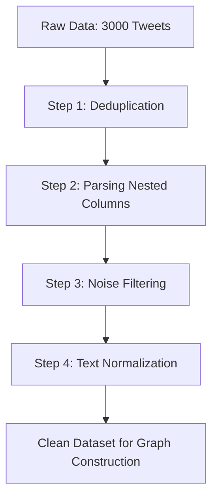
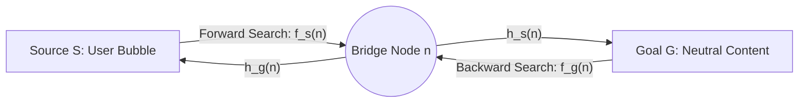

# Kecerdasan-Buatan-MBDA-Mitigate-Filter-Bubble
Proyek ini mengimplementasikan algoritma **Modified Bidirectional A* (MBDA*)** untuk memitigasi filter bubble konten politik pada aplikasi X (Twitter).

---

## 1. Pengambilan Data (Scraping)
Kami melakukan pengambilan data dari Twitter (X) menggunakan platform **Apify** dengan Actor `apify/twitter-x-data-tweet-scraper-pay-per-result-cheapest`. 

* **Strategi Kata Kunci (Keywords)**:
  Untuk mendapatkan cakupan bahasan politik dan ekonomi yang relevan di Indonesia, kami menggunakan **3 kata kunci utama**:
  1. `"makan bergizi gratis"` (Isu kebijakan sosial-politik terbaru)
  2. `"rupiah"` (Isu stabilitas ekonomi makro)
  3. `"prabowo"` (Tokoh politik sentral/Presiden terpilih)
* **Volume Data**:
  * Batas pengambilan diset sebanyak **1.000 tweet per kata kunci**.
  * Total data mentah terkumpul: **3.000 tweet**.
  * Data tersebut disimpan dalam file CSV resmi: [dataTwitter_1000.csv](file:///c:/scrapperTwitterX/dataTwitter_1000.csv).

---

## 2. Struktur & Skema Data Mentah (Raw Dataset Schema)
Setiap tweet yang diambil memiliki struktur metadata yang kaya untuk mendukung pembentukan graf dan analisis konten. Atribut utamanya meliputi:
* **`id` & `url`**: Identifikasi unik tweet.
* **`text`**: Konten teks dari tweet (digunakan untuk analisis kesamaan konten/TF-IDF).
* **`createdAt`**: Waktu pembuatan tweet.
* **Engagement Metrics**: `likeCount`, `retweetCount`, `replyCount`, dan `viewCount` (digunakan sebagai penentu bobot/keaktifan interaksi).
* **`author` (Nested JSON)**: Berisi informasi profil pengirim (username, display name, dll.).
* **`entities` (Nested JSON)**: Berisi informasi interaksi seperti `hashtags` dan `user_mentions` (daftar akun lain yang di-tag/sebut).

---

## 3. Pipeline Pembersihan & Pemrosesan Data (Data Preprocessing Pipeline)
Setelah data mentah dikumpulkan, kami merancang dan mengimplementasikan pipeline pemrosesan data otomatis di [mbda_star_pipeline.py](file:///c:/scrapperTwitterX/mbda_star_pipeline.py) melalui 4 tahap awal:



### Detail Langkah Preprocessing:
1. **Step 1: Basic Cleaning (Deduplication)**: Menghapus tweet duplikat berdasarkan kolom `id`. Ini penting karena satu tweet bisa muncul di beberapa kata kunci pencarian yang berbeda.
2. **Step 2: Parse Nested Columns**: Mengurai kolom JSON bersarang (`author` & `entities`) untuk mengekstrak `username`, `display_name`, `hashtags_list`, dan `mentions_list` (kunci utama pembentukan jaringan interaksi/graf).
3. **Step 3: Filter Noise**: Menyaring tweet hanya dalam Bahasa Indonesia (`in`) dan Inggris (`en`), serta menghapus tweet kosong atau yang memiliki `viewCount = 0` (menyaring spam/bot pasif).
4. **Step 4: Normalize Text**: Mengubah teks menjadi huruf kecil (*lowercase*), menghapus URL, mention (`@username`), hashtag (`#topic`), tanda baca, angka, dan spasi berlebih.

---

## 4. Pemodelan Graf & Komunitas (Louvain)
* **Graf Interaksi (Step 5)**: Membangun Directed Weighted Graph di mana *Node* melambangkan user, dan *Edge* melambangkan mention dengan bobot berdasarkan jumlah retweet dan reply.
* **Community Detection (Step 6)**: Mengelompokkan pengguna ke dalam kluster menggunakan algoritma Louvain untuk mendeteksi batas-batas *filter bubble* (echo chamber) berdasarkan pola interaksi mention mereka.

---

## 5. Implementasi Inti Metode MBDA* untuk Mitigasi Filter Bubble

Algoritma **Modified Bidirectional A* (MBDA*)** dirancang khusus sebagai solusi pencarian lintasan yang menjembatani polarisasi informasi politik pada aplikasi X. Algoritma ini berjalan dari dua arah secara bersamaan guna mempertemukan pengguna yang berada di dalam gelembung opini tertutup (*filter bubble*) dengan konten yang netral atau berimbang.

### A. Konsep Pencarian Dua Arah (Bidirectional)
Pencarian dilakukan secara simultan dari dua ujung jaringan:
1. **Pencarian Maju (Forward Search, $S \rightarrow G$):** Dimulai dari **Source ($S$)**, yaitu akun pengguna yang terperangkap di dalam kluster filter bubble tertentu (misalnya kluster bias ekstrim terhadap suatu isu).
2. **Pencarian Mundur (Backward Search, $G \rightarrow S$):** Dimulai dari **Goal ($G$)**, yaitu akun atau artikel bermuatan informasi Netral (seimbang).

Kedua arah pencarian ini akan mengekspansi jaringan interaksi sosial (mention graph) hingga bertemu di suatu akun penghubung (*bridge account*) di tengah jaringan.



---

### B. Formulasi Heuristik Mitigasi Filter Bubble

Untuk mengarahkan pencarian agar keluar dari filter bubble secara bertahap, fungsi evaluasi $f(n)$ dimodifikasi dengan mengintegrasikan dua fungsi heuristik berbasis konten (**TF-IDF Cosine Distance**):
* **Forward Evaluator:**
  $$f_s(n) = g(S,n) + \frac{1}{2} [ h_s(n) - h_g(n) ]$$
* **Backward Evaluator:**
  $$f_g(n) = g(G,n) + \frac{1}{2} [ h_g(n) - h_s(n) ]$$

Di mana:
* $g(n)$ adalah bobot akumulasi jarak sosial (interaksi/mention) dari titik awal ke node $n$.
* $h_s(n)$ adalah estimasi jarak konten node $n$ ke target informasi netral $G$ (`1 - similarity(text_n, neutral_text)`).
* $h_g(n)$ adalah estimasi jarak konten node $n$ ke profil awal pengguna $S$ (`1 - similarity(text_n, source_text)`).

---

### C. Mekanisme Kerja Heuristik di dalam Kode Program

Di dalam kode program [mbda_star_pipeline.py](file:///c:/scrapperTwitterX/mbda_star_pipeline.py), rumus evaluasi ini diimplementasikan langsung pada saat ekspansi tetangga (`nb`) untuk memandu prioritas pencarian:

```python
# Menghitung bobot sosial (semakin sering berinteraksi, semakin murah cost-nya)
gn = g + cost(cur, nb)

# Formulasi Heuristik MBDA* Dua Arah
if fwd:  # Pencarian dari S ke G
    # fs(n) = g + 0.5 * (h_s - h_g)
    fn = gn + 0.5 * (h_s(nb) - h_g(nb))
else:    # Pencarian dari G ke S
    # fg(n) = g + 0.5 * (h_g - h_s)
    fn = gn + 0.5 * (h_g(nb) - h_s(nb))

# Node dengan fn terkecil akan diekspansi terlebih dahulu
heapq.heappush(oq, (fn, gn, nb, path + [nb]))
```

---

### D. Mengapa MBDA* Efektif Memitigasi Filter Bubble Konten Politik?

1. **Memandu Keluar Secara Halus**: Komponen $[h_s(n) - h_g(n)]$ memastikan rute pencarian mengutamakan akun yang kontennya semakin netral (nilai $h_s(n)$ mengecil) sekaligus semakin berbeda dari konten awal pengguna (nilai $h_g(n)$ membesar).
2. **Menjaga Keterkaitan (Relevansi)**: Fungsi jarak sosial $g(n)$ memastikan lintasan rekomendasi tetap melewati akun-akun yang terhubung secara sosial (tidak melompat secara acak ke topik lain).
3. **Hasil Akhir (Output Lintasan)**: Algoritma ini menghasilkan urutan rekomendasi akun secara bergradasi (*stepping stone*). Pengguna diajak melangkah secara perlahan dari konten yang sangat familiar, melewati konten netral di titik temu, hingga diperkenalkan pada perspektif seberang (opini alternatif) tanpa memicu penolakan psikologis (*backfire effect*).
